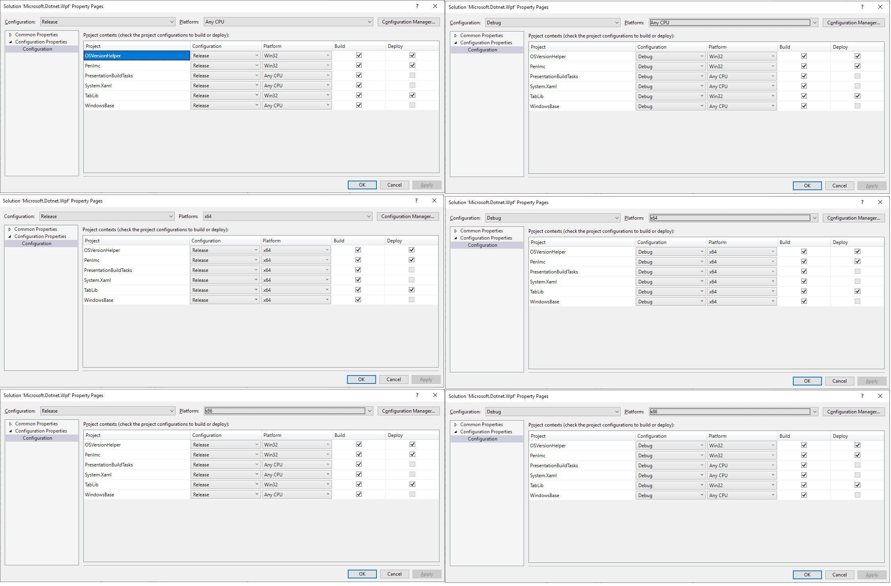

# Solution and Project Configuration

Solutions configurations are mapped to Project configurations in the following manner.

    <table>
     <tr>
      <th>Solution</th>
      <th>Managed Projects</th>
      <th>Native Projects</th>
     </tr>
     <tr>
      <td>Debug|AnyCPU</td>
      <td>Debug|AnyCPU</td>
      <td>Debug|Win32</td>
     </tr>
     <tr>
      <td>Debug|x86</td>
      <td>Debug|AnyCPU</td>
      <td>Debug|Win32</td>
     </tr>
     <tr>
      <td>Debug|x64</td>
      <td>Debug|x64</td>
      <td>Debug|x64</td>
     </tr>
     <tr>
      <td>Release|AnyCPU</td>
      <td>Release|AnyCPU</td>
      <td>Release|Win32</td>
     </tr>
     <tr>
      <td>Release|x86</td>
      <td>Release|AnyCPU</red></td>
      <td>Release|Win32</td>
     </tr>
     <tr>
      <td>Release|x64</td>
      <td>Release|x64</td>
      <td>Release|x64</td>
     </tr>
    </table>

- `AnyCPU` **solution** configuration is intended for developer-builds only. 
- Official build would *always* specify `x86` or `x64` solution configurations explicitly.
- Native projects should map `AnyCPU` solution-configuration to `x86` project configuration
- Managed projects should map `x86` solution-configuration to `AnyCPU` project configuration
- Use Solution->Properties->Configuration view to ensure that the mapping between solution-configuration and project configuration is consistent for every possible configuration. 
- Note that packaging projects under `nupkg` folder have only one (`AnyCPU`) configuration

