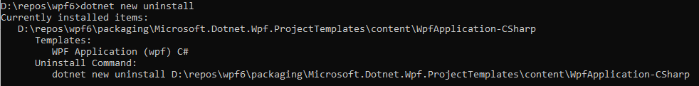

# WPF Projects Templates

We provide the following templates:
* [WPF Application (C#)](./content/WpfApplication-CSharp)
* [WPF Application (VB)](./content/WpfApplication-VisualBasic)
* [WPF Class library (C#)](./content/WpfClassLibrary-CSharp)
* [WPF Class library (VB)](./content/WpfClassLibrary-VisualBasic)
* [WPF Custom Control library (C#)](./content/WpfCustomControlLibrary-CSharp)
* [WPF Custom Control library (VB)](./content/WpfCustomControlLibrary-VisualBasic)
* [WPF User Control Library (C#)](./content/WpfUserControlLibrary-CSharp)
* [WPF User Control Library (VB)](./content/WpfUserControlLibrary-VisualBasic)

## Testing Templates

Before submitting a change to any of the templates please make sure to test them locally.

1. Install the required template with `dotnet` tool (e.g. `WpfApplication-CSharp`).<br />
In the command prompt of your choice run the following command:
    ```
    > dotnet new install <path to the repo>\wpf\packaging\Microsoft.Dotnet.Wpf.ProjectTemplates\content\WpfApplication-CSharp
    ```

2. To confirm that the template is correctly installed run the following command and look for your template:
    ```
    > dotnet new uninstall
    ```
    

3. Create an app from your template:
    ```
    > dotnet new wpf -n testapp1
    ```

4. Verify the app behaves as expected.    
If necessary, tweak the template and create new apps.

5. Once you are happy with the template, you can uninstall it to revert to the original by running the command given in `dotnet new uninstall` output; e.g.
    ```
    > dotnet new uninstall <path to the repo>\wpf\packaging\Microsoft.Dotnet.Wpf.ProjectTemplates\content\WpfApplication-CSharp
    ````
